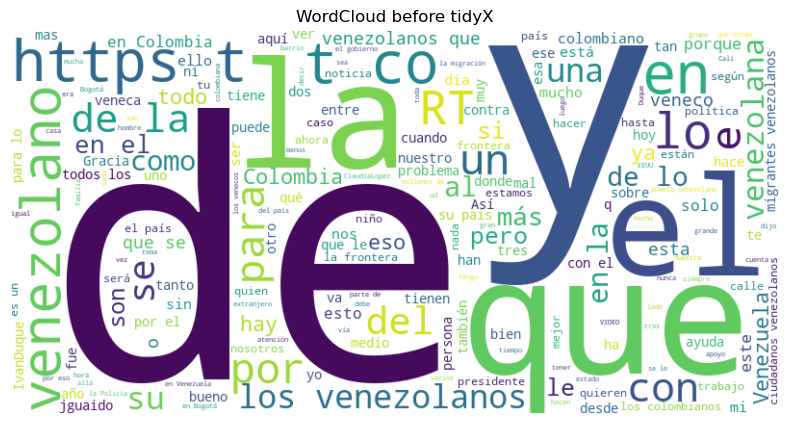
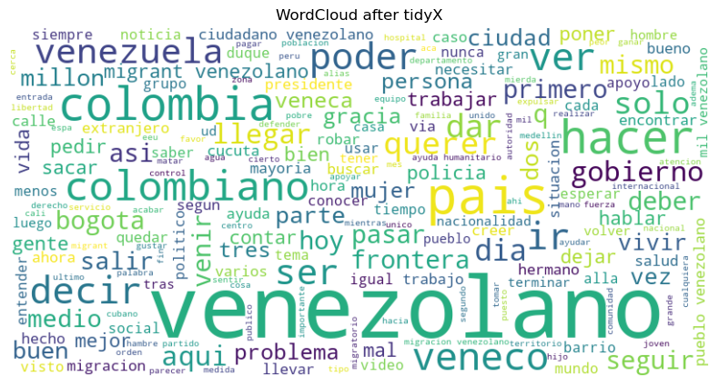

=================================
Welcome to tidyX's documentation!
=================================

tidyX is a Python package designed for cleaning and preprocessing text for machine learning applications, **especially for text written in Spanish and originating from social networks.** This library provides a complete pipeline to remove unwanted characters, normalize text, group similar terms, etc. to facilitate NLP applications.

Installation
============

Install the package using pip:

.. code-block:: bash

   pip install tidyX

Make sure you have the necessary dependencies installed. If you plan on lemmatizing, you'll need `spaCy` along with the appropriate language models. For Spanish lemmatization, we recommend downloading the `es_core_web_sm` model:

.. code-block:: bash

   python -m spacy download es_core_news_sm  

For English lemmatization, we suggest the `en_core_web_sm` model:

.. code-block:: bash

   python -m spacy download en_core_web_sm 

To see a full list of available models for different languages, visit `Spacy's documentation <https://spacy.io/models/>`_.

.. toctree::
   :maxdepth: 2
   :caption: Usage

   usage/standardize_text_pipeline
   usage/stemming_and_lemmatizing
   usage/group_similar_terms
   usage/remove_unwanted_elements
   usage/dependency_parsing_visualization

.. toctree::
   :maxdepth: 2
   :caption: Tutorials

   tutorials/stemming_and_lemmatizing_efficiently
   tutorials/word_cloud
   tutorials/topic_modelling

.. toctree::
   :maxdepth: 3
   :caption: User Documentation

   user_documentation/TextPreprocessor
   user_documentation/TextNormalization
   user_documentation/TextVisualizer

Contributing
============

Contributions to enhance `tidyX` are welcome! Feel free to open issues for bug reports, feature requests, or submit pull requests in our `github repo <https://github.com/lgomezt/tidyX>`_.  If this package has been helpful, please give us a star :D