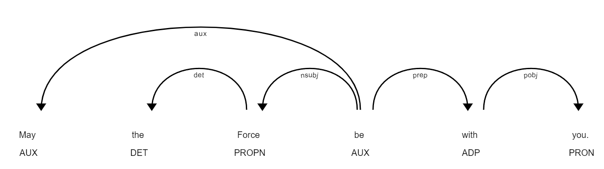

Dependency Parsing Visualization
---------------------------------

The `dependency_parse_visualizer_text() <https://tidyx.readthedocs.io/en/latest/user_documentation/TextVisualizer.html#tidyX.text_visualizer.TextVisualizer.dependency_parse_visualizer_text>`_ function facilitates the visualization of dependency parsing or named entity recognition (NER) for individual text documents. By utilizing spaCy's DisplaCy tool, it graphically showcases linguistic attributes. Users can specify the visualization style, determine if they are operating in a Jupyter notebook, and choose which spaCy model is most appropriate for their parsing needs.

Make sure you have the necessary dependencies installed. You'll need `spaCy` along with the appropriate language models. For Spanish, we recommend downloading the `es_core_news_sm` model:

.. code-block:: bash

   python -m spacy download es_core_news_sm   

For English, we suggest the `en_core_web_sm` model:

.. code-block:: bash

   python -m spacy download en_core_web_sm 

.. code-block:: python
      
    from tidyX import TextVisualizer as tv
    import spacy

    document = "May the Force be with you."

    # Load spaCy's English model
    model = spacy.load('en_core_web_sm')

    # Display the dependency parse
    tv.dependency_parse_visualizer_text(document, model=model, style='dep', jupyter=True)

.. code-block:: python

    document = "Luke Skywalker and Darth Vader are iconic characters in the Star Wars universe."

    # Show the named entities
    tv.dependency_parse_visualizer_text(document, model=model, style='ent', jupyter=True)

